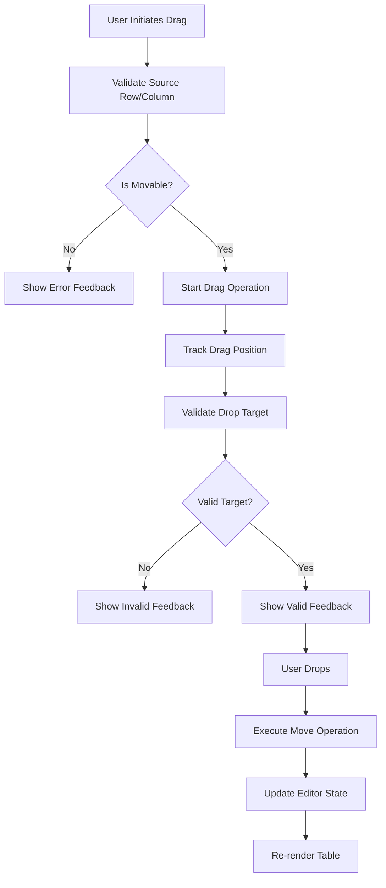
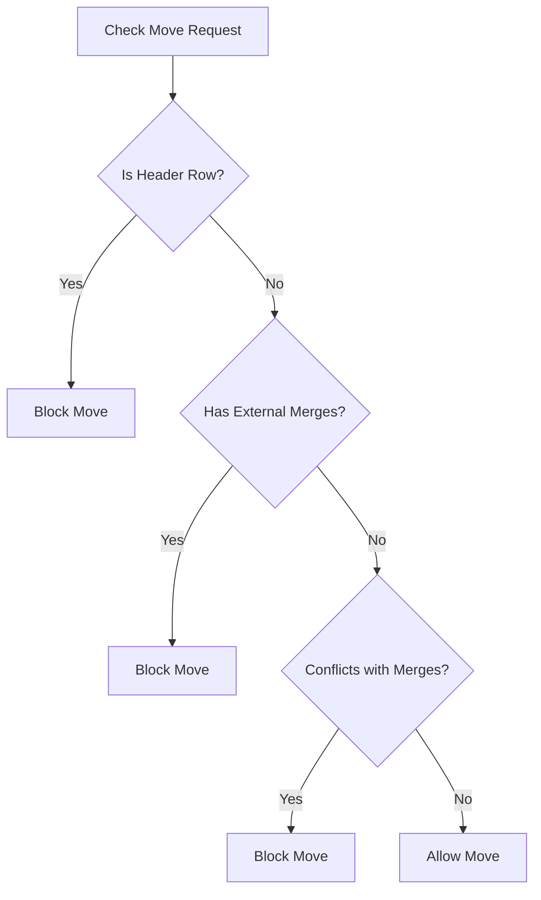

# 🏗️ Comprehensive Plan: Drag-and-Drop for Rows and Columns

Based on analysis of the slate-table codebase and requirements, here's a detailed implementation plan for adding drag-and-drop functionality to the slate-table editor.

## 📋 Current Architecture Analysis

The slate-table library has a well-structured architecture:
- **Core Engine**: `TableEditor` provides static methods for table manipulation
- **Matrix System**: `filledMatrix` creates a 2D representation of the table accounting for merged cells
- **Navigation**: `TableCursor` handles cursor movement and selection
- **Demo Site**: React-based implementation in `site/src/components/Editor.tsx`

## 🎯 Business Requirements

### Row Requirements:
- ✅ Users can rearrange rows within the table
- ❌ Header rows cannot be rearranged
- ✅ Header rows always stay on top
- ❌ Rows with merged cells spanning other rows cannot be rearranged
- ✅ Rows with internal merged cells can be rearranged
- ✅ Rows can be rearranged around rows with merged cells

### Column Requirements:
- ✅ Users can rearrange columns within the table
- ❌ Columns with merged cells spanning other columns cannot be rearranged
- ✅ Columns with internal merged cells can be rearranged
- ✅ Columns can be rearranged around columns with merged cells

## 🎯 Implementation Strategy

### Phase 1: Core Drag-and-Drop API Extensions

#### 1.1 New TableEditor Methods
Add new methods to `TableEditor` for row/column reordering:

```typescript
// New methods to add:
TableEditor.moveRow(editor: Editor, options: { from: number, to: number, at?: Location }): boolean
TableEditor.moveColumn(editor: Editor, options: { from: number, to: number, at?: Location }): boolean
TableEditor.canMoveRow(editor: Editor, options: { rowIndex: number, at?: Location }): boolean
TableEditor.canMoveColumn(editor: Editor, options: { columnIndex: number, at?: Location }): boolean
```

#### 1.2 Validation Logic
Create validation functions to enforce business rules:

```typescript
// Validation functions:
- isHeaderRow(rowIndex: number): boolean
- hasVerticalMergedCells(rowIndex: number): boolean  
- hasHorizontalMergedCells(columnIndex: number): boolean
- canMoveAroundMergedCells(from: number, to: number): boolean
```

### Phase 2: Matrix Analysis Enhancement

#### 2.1 Enhanced Matrix Utilities
Extend `filledMatrix` system to provide:

```typescript
// New utility functions:
- getRowMergeInfo(matrix: NodeEntryWithContext[][], rowIndex: number): MergeInfo
- getColumnMergeInfo(matrix: NodeEntryWithContext[][], columnIndex: number): MergeInfo  
- isRowMovable(matrix: NodeEntryWithContext[][], rowIndex: number): boolean
- isColumnMovable(matrix: NodeEntryWithContext[][], columnIndex: number): boolean
```

#### 2.2 Merge Detection
Implement sophisticated merge detection:
- **Vertical merges**: Cells spanning multiple rows (`rowSpan > 1`)
- **Horizontal merges**: Cells spanning multiple columns (`colSpan > 1`)
- **Internal merges**: Merges within the same row/column (allowed)
- **External merges**: Merges crossing row/column boundaries (blocking)

### Phase 3: UI Enhancement

#### 3.1 Drag Handles
Add visual drag handles to the table interface:

```tsx
// New components:
<RowDragHandle rowIndex={index} />
<ColumnDragHandle columnIndex={index} />
```

#### 3.2 Visual Feedback System
Implement comprehensive visual feedback:
- **Drag Preview**: Ghost image of the row/column being dragged
- **Drop Zones**: Highlighted areas where dropping is allowed
- **Invalid Zones**: Visual indication of prohibited drop areas
- **Merge Conflicts**: Clear indicators when moves are blocked by merges

#### 3.3 Enhanced Table Component
Modify `Table` component to include:
- Drag handle positioning
- Drop zone overlays  
- Drag state management
- Visual feedback rendering

### Phase 4: Interaction Handling

#### 4.1 Drag Events
Implement HTML5 Drag and Drop API:

```typescript
// Event handlers:
- onDragStart: Initiate drag operation
- onDragOver: Handle drag-over validation  
- onDragEnter: Visual feedback on valid targets
- onDragLeave: Clear feedback on invalid targets
- onDrop: Execute the move operation
```

#### 4.2 Touch Support
Add mobile/touch device support:
- Long-press to initiate drag
- Touch move tracking
- Touch-friendly drop zones

## 🔧 Technical Implementation Details

### Core Algorithm Flow



### Validation Rules Implementation



### Data Structure Changes

#### New Types
```typescript
interface DragState {
  isDragging: boolean;
  dragType: 'row' | 'column';
  sourceIndex: number;
  targetIndex?: number;
  isValidTarget: boolean;
}

interface MergeInfo {
  hasInternalMerges: boolean;
  hasExternalMerges: boolean;
  mergedCells: NodeEntry<CellElement>[];
  blockedIndices: number[];
}
```

## 📁 File Structure Changes

### New Files to Create:
1. **`src/drag-drop.ts`** - Core drag-drop logic
2. **`src/utils/merge-analysis.ts`** - Merge detection utilities
3. **`src/utils/move-validation.ts`** - Movement validation logic
4. **`site/src/components/DragHandle.tsx`** - Drag handle components
5. **`site/src/components/DropZone.tsx`** - Drop zone components
6. **`site/src/hooks/useDragDrop.ts`** - React hook for drag-drop state

### Files to Modify:
1. **`src/table-editor.ts`** - Add move methods
2. **`src/index.ts`** - Export new functionality
3. **`site/src/components/Editor.tsx`** - Integrate drag-drop UI
4. **`site/src/components/Toolbar.tsx`** - Add toggle for drag mode

## 🎨 User Experience Flow

### 1. **Activation**
- User hovers over row/column → drag handles appear
- Handles only appear for movable rows/columns
- Disabled handles for headers and merged cells

### 2. **Drag Initiation**
- User clicks and drags handle
- Source row/column gets visual feedback (dimmed/outlined)
- Cursor changes to indicate drag mode

### 3. **Target Selection**
- Valid drop zones highlight as user drags
- Invalid zones show prohibition indicator
- Real-time feedback on drop validity

### 4. **Drop Execution**
- Smooth animation of row/column movement
- Automatic editor state update
- Preservation of cell content and formatting

## 🧪 Testing Strategy

### Unit Tests
- **Validation Logic**: Test all merge detection scenarios
- **Move Operations**: Test successful and failed moves
- **Edge Cases**: Header rows, complex merges, boundary conditions

### Integration Tests  
- **UI Interactions**: Full drag-drop workflows
- **Cross-browser**: Ensure compatibility across browsers
- **Touch Devices**: Mobile drag-drop functionality

### User Acceptance Tests
- **Business Rules**: All specified constraints work correctly
- **Performance**: Smooth interactions with large tables
- **Accessibility**: Keyboard navigation alternatives

## 🔄 Migration Strategy

### Backward Compatibility
- All existing APIs remain unchanged
- New features are opt-in through configuration
- Graceful degradation when drag-drop is disabled

### Progressive Enhancement
- Basic table functionality works without drag-drop
- Enhanced UX when drag-drop is enabled
- Feature detection for browser capabilities

## 📈 Future Enhancements

### Phase 2 Features
- **Multi-row/column selection**: Drag multiple rows/columns at once
- **Cross-table moves**: Move rows/columns between different tables
- **Undo/Redo**: Integration with slate-history for move operations
- **Keyboard shortcuts**: Alt+Arrow keys for row/column movement

### Performance Optimizations
- **Virtual scrolling**: Handle large tables efficiently
- **Lazy validation**: Validate moves only when needed
- **Memoization**: Cache merge analysis results

## 🚀 Implementation Phases

### Phase 1: Core Foundation (Week 1-2)
- Implement core `TableEditor` move methods
- Create validation logic for merge constraints
- Add basic matrix analysis utilities

### Phase 2: UI Integration (Week 3-4)
- Create drag handle components
- Implement visual feedback system
- Add touch support

### Phase 3: Polish & Testing (Week 5-6)
- Comprehensive testing suite
- Performance optimization
- Documentation and examples

This plan provides a comprehensive roadmap for implementing robust drag-and-drop functionality for both rows and columns while respecting the complex constraints around merged cells and maintaining the clean architecture of the slate-table library.