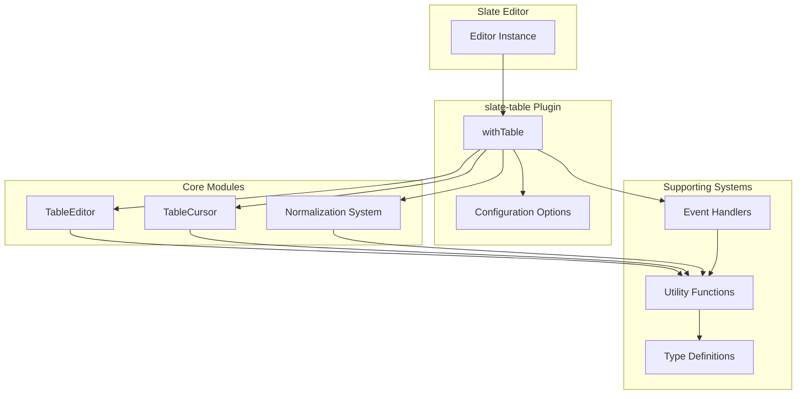
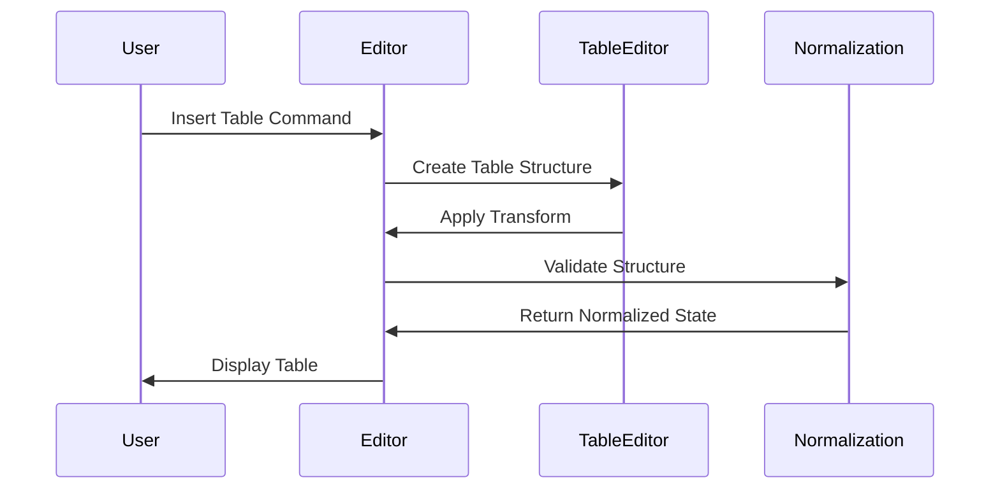
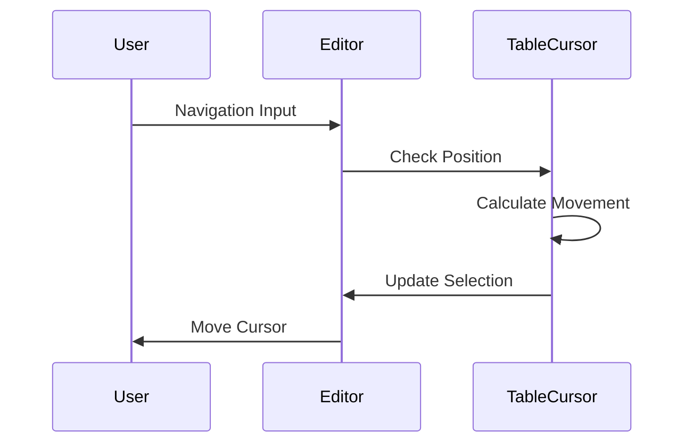

# slate-table: High-Level Design Documentation

## 1. Introduction

### 1.1 Purpose
The purpose of this High-Level Design (HLD) document is to provide a comprehensive overview of the **slate-table** plugin for Slate.js. It outlines the architecture, key components, and functionalities of the plugin, serving as a guide for developers and stakeholders involved in the project.

### 1.2 Scope
This document covers:
- Detailed architectural design of the slate-table plugin
- Core features and functionality specifications
- Component interactions and data flows
- Technical stack and integration patterns
- Performance considerations and limitations
- Testing strategy and quality assurance approach

Out of scope:
- Detailed implementation instructions
- Code-level specifications
- Development environment setup
- Deployment procedures

### 1.3 Audience
- **Development Team**: Engineers implementing and maintaining the plugin
- **Project Managers**: For understanding system capabilities and technical constraints
- **Technical Stakeholders**: Architects and tech leads evaluating the solution
- **QA Team**: For understanding testable components and expected behaviors

## 2. Feature Overview

### 2.1 Feature Description
The slate-table plugin provides comprehensive table editing capabilities for Slate.js:

Core Features:
- Table creation and deletion
- Row and column management
- Cell merging and splitting
- Complex cell spanning (rowspan/colspan)
- Intelligent cursor navigation
- Selection management
- Structure normalization

### 2.2 Use Cases
1. Content Editing
   - Create tables with specified dimensions
   - Insert/delete rows and columns
   - Merge/split cells for complex layouts
   - Navigate through cells using keyboard

2. Data Organization
   - Structure content in tabular format
   - Manage header rows/columns
   - Handle complex table layouts

3. Document Authoring
   - Create documentation with tables
   - Edit existing table structures
   - Maintain table integrity

## 3. System Architecture

### 3.1 High Level Architecture Diagram


### 3.2 Component Interaction
Core components interact through a well-defined plugin architecture:
- **withTable**: Main plugin composition
- **TableEditor**: Core table operations
- **TableCursor**: Navigation and selection
- **Normalization**: Structure validation

### 3.3 User Flow Charts

1. Table Creation Flow


2. Cell Navigation Flow


## 4. Design Details

### 4.1 Frontend Design

#### Technology Stack
- Slate.js (>= 0.100.0)
- TypeScript
- React (for demo implementation)
- Next.js (demo site)
- Tailwind CSS (demo styling)

#### UI Components
1. Editor Component
   - Table rendering
   - Event handling
   - Selection management

2. Toolbar Component
   - Table operations
   - Formatting controls
   - Status indicators

### 4.2 Backend Design

#### Technology Stack
- TypeScript
- Jest (testing)
- tsup (bundling)

#### API Design
Core API methods:
```typescript
export interface TableEditor {
  insertTable(editor, options): void
  removeTable(editor, options): void
  insertRow(editor, options): void
  removeRow(editor, options): void
  insertColumn(editor, options): void
  removeColumn(editor, options): void
  merge(editor): void
  split(editor, options): void
}
```

#### Data Structures
1. Matrix Representation
```typescript
type FilledMatrix = Array<Array<[NodeEntry<CellElement>, CellContext]>>

interface CellContext {
  ltr: number  // left-to-right span
  rtl: number  // right-to-left span
  ttb: number  // top-to-bottom span
  btt: number  // bottom-to-top span
}
```

#### Error Handling
- Validation through normalization system
- Type checking with TypeScript
- Runtime checks for operations
- Error boundaries in React components

### 4.3 Database Design
Not applicable - plugin operates on in-memory document structure

### 4.4 Third-Party Integrations
1. Slate.js Integration
   - Plugin architecture compliance
   - Editor customization
   - Command handling

2. React Integration (Optional)
   - Component rendering
   - Event handling
   - State management